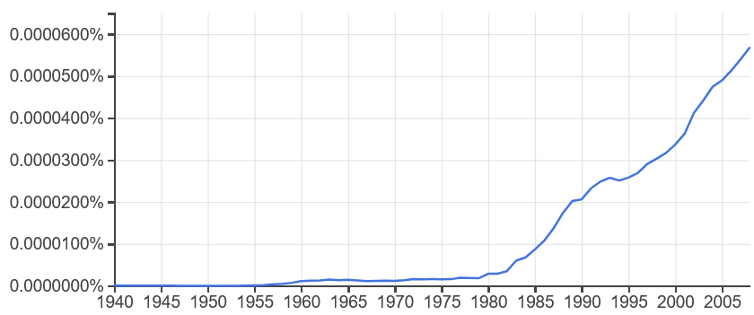
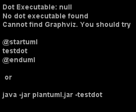

# __Etude de biais dans l'apprentissage automatique__

## Plus précisément, l'effet cigogne dans le cas de l'apprentissage automatique par renforcement

# Introduction

## Réflexion

Tout vient d'une réflexion sur la différence entre corrélation et causalité. C'est un problème qui survient systématiquement lorsqu'on fait des statistiques descriptives à partir de données dont on dispose. 

L'apprentissage automatique peut lui aussi subir ce biais, ne serait-ce que parce que le biais vient des données en entrées, et ce, malgré une validation croisée.

Quelle réponse peut-on apporter à ce biais ?

Dans le monde réel, avec une randomisation : couper aléatoirement un échantillon en deux, agir sur seulement l'une des moitiés, et comparer les résultats entre les deux groupes.

Est-ce applicable à l'apprentissage automatique ?

Il faut pour cela que l'algorithme puisse agir sur son environnement pour apprnedre non seulement à partir de données initiales, mais aussi à partir du résultat de ses actions. 

On peut donc imaginer ajouter d'une randomisation au sein d'un algorithme d'apprentissage par renforcement pour améliorer ses résultats, ou du moins pour voir si ses résultats évoluent.

## Définitions

Effet cigogne : confusion entre corrélation et causalité

Corrélation : lien mesurable statistiquement entre deux variables

Causalité : Lien de cause à effet entre deux phénomènes

__Définitions issues principalement du Journal officiel n° 0285 du 09/12/2018 :__

> https://www.legifrance.gouv.fr/jo_pdf.do?id=JORFTEXT000037783813

Apprentissage automatique : "Processus par lequel un algorithme évalue et améliore ses performances sans l’intervention d’un programmeur, en répétant son exécution sur des jeux de données jusqu’à obtenir, de manière régulière, des résultats pertinents".

Le journal officiel le traduit par "machine learning" en anglais. Cela n'est pas certain quand on compare les fréquences de ces expressions au cours du temps avec Ngrams viewer.

Soit l'expression "apprentissage automatique" était porteuse d'un tout autre sens dans les années 1960, soit il s'agit de deux notions différentes avec le même nom.

Apprentissage automatique dans le corpus francophone :

Machine learning dans le corpus anglophone :

Apprentissage par renforcement : "Apprentissage automatique dans lequel un programme extérieur évalue positivement ou négative-ment les résultats successifs de l’algorithme, l’accumulation des résultats permettant à l’algorithme d’améliorer ses performances jusqu’à ce qu’il atteigne un objectif préalablement fixé."

Agent : algorithme d'apprentissage par renforcement.

## Problématique

Par "biais", on considèrera la définition suivante : "une démarche ou un procédé qui engendre des erreurs".

La définition formelle en statistique de biais, "différence entre la valeur de l'espérance d'un estimateur et la valeur qu'il est censé estimer" correspondrait à un problème de régression. 

Pour un algorithme d'apprentissage par renforcement, l'objectif n'est pas tant d'estimer au plus proche une variable que d'en maximiser une. Cela dit, comme les algorithmes d'apprentissage automatique utilisent des indicateurs statistiques sensibles aux biais, ils sont aussi soumis au dilemme biais-variance (le biais diminue à mesure que la complexité du modèle s'approche de la complexité de l'environnement).

- Peut-on utiliser l'apprentissage par renforcement pour différencier des corrélations de causalités ? Pour prouver l'existence de causalités ?

 - Très général... Comment le traduire en une expérience ?

- Dans quelle mesure ce biais influence-t-il le résultat de prédictions basées sur l'apprentissage automatique ?

- En cas de correction d'un modèle biaisé, avec quelle inertie les algorithmes apprennent de leurs erreurs ?

### Autres comparaisons possibles

- Quelle est l'efficacité l'agent qui ne peut apprendre qu'avec des données ayant déjà été observées et biaisées (apprentissage supervisé)

 - En utilisant le replaybuffer ? Transformer le as_dataset en array numpy ?

- Versus l'efficacité si on pré-entraine l'agent avec des données ayant déjà été observées puis qu'on le laisse se renforcer sans randomisation (apprentissage supervisé et par renforcement)

 - Randomisation, n'est-elle pas en quelque sorte déjà faite par l'algo lors de l'exploration ?

 - Si oui, dans quelle mesure l'algo est-il sensible à l'évolution de paramètres qu'il ne peut observer ?

 - Randomisation : passer de temps en temps en random policy ou en collect policy pour réduire l'intertie ?

- Versus l'efficacité si on pré-entraine l'agent avec des données ayant déjà été observées puis qu'on le laisse se renforcer avec randomisation (apprentissage supervisé et par renforcement)

Questions supplémentaires, dans le cas où je développe un algorithme qui effectue explicitement une randomisation pour tester si les corrélations observées sont des causalités :

- Versus l'efficacité de l'apprentissage par renforcement seul avec randomisation

- Versus l'efficacité de l'apprentissage par renforcement seul sans randomisation

### L'apprentissage automatique pour prouver l'existence de causalité ?

La question de confusion entre corrélation et causalité dans le cas de l'apprentissage automatique peut être considéré comme triviale du point de vue des algorithmes. En effet, ceux-ci n'étudient pas les causalités, seulement des corrélations. C'est au moment où ces algorithmes sont utilisés au sein d'une application que l'intelligence humaine (des développeurs, des analystes) va biaiser la situation.

Cependant, peut-on utiliser des algos d'apprentissage par renforcement pour trouver/prouver des relations de causalité entre des variables ?

Pour les variables de ses actions, on peut se dire que oui : il suffit de le laisser agir pour qu'il fasse ou non varier les autres observations et la récompense.

Cependant, si la récompense augmente, et que les observations évoluent de façon linéaire au fil du temps cela ne prouve pas forcément que les actions font s'améliorer la récompense. Il est possible que la seule relation de causalité soit non pas entre les actions d'un côté, la récompense et les observations de l'autre, mais entre le temps et ces dernières.

# I- Revue de littérature

## A- Une question triviale ?

### a) Dans le cas d'une régression

__Pourquoi parler de la régression ?__

Dans le cas d'une régression, la question peut sembler triviale.

Si confusion entre corrélation et causalité il y a, ça n'est pas au niveau des algorithmes d'apprentissage automatique, qui n'étudient que les corrélations. C'est lors de l'utilisation de ces algorithmes qu'il peut y avoir confusion.

Puisqu'une régression consiste à mesurer les corrélations entre toutes les variables afin d'en estimer une à partir des autres, il suffit que certaines variables soient corrélées avec la celle à estimer pour biaiser les résultats. Pour combattre ce biais, il faut qu'un être humain analyse le contexte pour déterminer s'il y a causalité entre les variables.

> http://www.cems.uwe.ac.uk/~irjohnso/coursenotes/uqc832/tr-bias.pdf

Cependant, cette étude montre que même dans le cas d'une régression il existe des méthodes permettant de diminuer ce biais

### b) Dans le cas de l'apprentissage par renforcement

Si le cas de la régression semblait trivial, c'est peut-être parce que l'algorithme n'a pas l'occasion d'interagir avec son environnement pour tester ce qui est une corrélation et ce qui est une causalité.

On peut d’ailleurs différencier trois types de variables qui construisent la réalité avec laquelle interagit un agent :

- les données intrinsèques à l'environnement (une partie des observations)

- les entrées (les actions de l'agent sur l'environnement)

- Les sorties issues des actions sur l'environnement (la récompense et une partie des observations)

Au sein des librairies que nous utiliseront, ces variables sont découpées de la sorte :

- Les observations (qu'elles dépendent des actions de l'agent ou non)

- Les actions (les décisions prises par l'agent)

- La récompense (ce que l'agent doit maximiser)

Ainsi, contrairement au cas d'une régression, il est déterminé dès le départ sur quoi l'agent peut agir. L'agent ne peut pas vérifier l'existence de causalité entre deux variables qui ne dépendent pas de lui. 

On pourrait se dire que l'algorithme fera explorera l'environnement à sa disposition pour maximiser sa récompense indépendamment de toute notion de toute notion de causalité. Cependant, il reste possible d'expérimenter si et dans quelle mesure l'algorithme tombe dans des biais.

### c) Exemples réels

Dans le cas de l'application de sélection de CV d'Amazon qui défavorisait les profils féminins, l'erreur vient du fait qu'on ait utilisé des données biaisées (des recrutements ayant eu lieu durant 10 années). 

Derrière l'expression "l'application défavorise les profils féminins", on pourrait comprendre "l'algorithme suppose qu'il y a une causalité entre le genre d'un individu et ses compétences". Or, il s'agit davantage de "l'algorithme observe une corrélation entre le genre des individus et leur proportion au sein des recrutements à laquelle il lui a été demandé de correspondre". 

Le problème n'est donc pas intrinsèque à l'algorithme, mais dû aux données en entrée, et à la décision de partir de ces données pour obtenir ce résultat. Il s'agit d'un biais présent dans les données d'apprentissage, ainsi que d'une erreur humaine de confusion entre corrélation et causalité, les concepteurs ayant supposé que les choix de recrutement passés étaient des décisions sinon optimales, au moins de bons exemples vers lesquels tendre, alors que ces choix étaient marqués d'erreurs humaines.

## B- Les différents cas de corrélation

### a) Théoriques

Sachant que A est corrélé à B, il y a plusieurs explications possibles :

- A cause B

- B cause A

- A cause B et B cause A

- C connu cause A et B

- C inconnu cause A et B

- Coincidence

Si on ne peut observer C, peut-on différencier le cas 5 du cas 6 ? Peut-on estimer que nos données semblent répondre à une variable supplémentaire inconnue à partir d'une certaine quantité de données permettant d'écarter l'idée d'une coincidence ? Si oui, peut-on mesurer cette variable ? (sachant qu'on risque de la confondre avec le vrai bruit statistique)

### b) Illustration de ces cas

Dans le cas où A, la quantité vendue, est corrélé à une variable B

- La quantité vendue cause le résultat net

- Le prix de vente cause la quantité vendue

- Le nombre de ventes cause la fréquentation à venir, qui cause le nombre de ventes à venir

- Les jours d'affluence causent la quantité vendue d'un produit et celle d'un autre produit

- La complémentarité entre la farine et la levure cause une corrélation entre les quantités vendues de l'un et de l'autre

- Une variable n'ayant aucun lien de causalité avec quoi que ce soit (ex: l'horoscope des sagittaires) peut néanmoins se retrouver corrélé avec d'autres variables si on ne dispose pas d'un échantillon suffisament grand. Peut alors exister un biais de sur-apprentissage.

## C- Exemples de biais dans l'apprentissage automatique

### a) Biais induits au sein des algorithmes

> https://arxiv.org/pdf/1907.02908.pdf

Quand un agent est développé pour répondre à un besoin spécifique, on peut être tenté de le paramétrer via des connaissances préexistantes afin d'améliorer ses résultats. Cela peut causer des erreurs supplémentaires, en plus de rendre l'algorithme moins généralisable.

#### Exemple de ce problème dans notre expérimentation

Si notre agent doit acheter des marchandises puis les vendre, avec comme récompense la marge sur coûts variables.

Pour lui éviter d'essayer des cas triviaux et a priori contreproductifs, on serait tenté de le paramétrer de telle sorte qu'il ne fixe jamais de prix de vente inférieur au prix d'achat. Ce qui serait une bonne idée sans compter que :

- Un produit d'appel peut être vendu à perte et pourtant améliorer le revenu global

- Si l'agent doit gérer ses stocks, il peut arriver qu'il doive vendre à perte pour déstocker (ex: péremption)

- Vendre ou acheter à perte peut parfois être une obligation légale 

 - Exemple : EDF qui achète à un prix plancher l'électricité issue d'énergies renouvelables sur le marché à terme de l'électricité

### b) Coïncidence

Il s'agit d'une question purement statistique. Il suffit d'avoir assez de données.

Peut-on considérer les erreurs qui y sont dues comme un exemple de sur-apprentissage ?

### c) Données d'apprentissage non représentatives (dont Biais de sélection)

#### Peut-on tromper l'agent s'il ne peut déterminer l'importance de ses actions dans la récompense finale ?

Si 80% de sa récompense est basée sur 20% de ses actions, l'algorithme mettra plus de temps à estimer l'importance respective de chaque variable.

On peut maximiser ce biais :

- En fournissant une récompense et/ou des observations aggrégées à une granularité trop épaisse

- Nous arrivons alors à une coïncidence et un biais de surapprentissage

#### https://app.wandb.ai/stacey/aprl/reports/Adversarial-Policies-in-Multi-Agent-Settings--VmlldzoxMDEyNzE

Résumé du protocole de cette publication :

- On prend deux agents, A et B, et un jeu compétitif.

- A apprend à jouer à partir de données de véritables joueurs.

- Puis B apprend à jouer contre A

Il en résulte que la meilleure manière pour B de gagner consiste à ne pas jouer. En effet, A n'a appris à jouer que contre des personnes qui savent jouer. B faisant des choses inattendues, A perd tout seul.

Conclusion : l'apprentissage par renforcement gagne sur le long terme face à un programme exclusivement formé sur des données qui ne recouvrent pas assez de cas.

### d) Biais de confirmation

Les algos y sont-ils sensibles ? Causalité au début qui décroit avec le temps, mais l'algo continue dans le sens initial ?

Testable, mais consiste surtout à mesurer l'inertie de l'algorithme à un changement du poids de ses variables

### e) Tous biais confondus

Même s'ils se corrigent facilement et automatiquement dans les algos déjà existants, on peut toujours en mesurer et comparer leurs interties.

# II- Description des expérimentations

Faire interagir un agent suivant plusieurs algorithmes d'apprentissage par renforcement pour apprendre face à un environnement biaisé.

Pour créer des situation biaisées, on préfèrera utiliser une librairie permettant de créer un environnement.

J'ai choisi Tensorflow, car la documentation semble claire et bien fournie, et que la librairie implémente de nombreux algorithmes de différentes catégories.

Diagramme de classes simplifié :

Le code est quant à lui sur le repository suivant : https://github.com/OdelinT/Memoire

(tant qu'il n'est pas public, me demander pour y accéder)

## A- L'agent

### a) Les algorithmes existants

Algorithmes présents dans TF :

- [DQN][1]

- [REINFORCE][2]

- [DDPG][3]

- [TD3][4]

- [PPO][5]

- [SAC][6]

### b) Ajouter une étape de randomisation

Dans tensorflow, en faisant quelques explorations en random_policy

### c) Configuration et enregistrement des résultats

Outils prévus à cet effet dans tensorflow : Replay buffer, et sa méthode As_dataset. Plus qu'à comprendre comment itérer dessus, car un '

## B- L'environnement

On peut imaginer des prix mis à jour en temps réel par l'agent, l'objectif de l'agent étant de trouver le prix maximisant le résultat net.
L'environnement répondrait, pour chaque offre, une demande (un nombre d'achats).

Cas réels qui correspondraient : prix dans un centre commercial connecté, sur un site d'e-commerce, sur un marché à terme en temps réel (financier, de l'électricité, du blé), etc.

Dans TF, on peut créer deux types d'environnement : py_environment.PyEnvironment ou tf_environment.TFEnvironment. Les deux prennent en compte des paramètres similaires. Dans notre exemples :

- Le temps est linéaire et discret

- Action: pour chaque lieu et/ou produit, un prix de vente

- Observation: pour chaque lieu et/ou produit, une demande

- Récompense: la somme, pour chaque lieu et/ou produit, du prix de vente auquel on soustrait le prix d'achat.

## C- Les biais à implémenter

La classe de l'environnement basique sera dupliquée en plusieurs versions, chacune ayant pour but de tester un biais ou une situation spécifique.

La graine des paramètres aléatoires sera la même dans tous les environnements, et on créera un test unitaire pour vérifier que les paramètres générés dans les différents environnements seront bien identiques. Cela permettra d'écarter la possibilité que certains environnement soient, au moment de l'exécution des tests, plus favorables que les autres.

On pourrait utiliser un système d'héritage, mais les classes sont assez courtes et les paramètres à faire évoluer ne sont présents que dans deux méthodes à redéfinir. Il est donc bien plus simple et lisible de dupliquer les classes sans lien d'héritage entre elles.

### a) Trop paramétrer l'environnement

Comme mentionné plus tôt, on peut être tenté de contraindre notre agent dans ses actions lui éviter d'essayer des action qui nous paraissent contreproductives.

> https://arxiv.org/pdf/1907.02908.pdf

Dans notre cas, on peut en effet afin d'obtenir des résultats plus rapidement interdire à notre environnement de vendre à un prix inférieur à son coût unitaire.

Ici, l'action correspond au prix auquel on vend un produit, exprimé en un coeficient multiplicateur du coût unitaire de ce produit.

~~~ Python
self._action_spec = array_spec.BoundedArraySpec(
 shape=(1,), dtype=np.float32, minimum=1, maximum=100, name='action')
~~~

~~~ Python
self._action_spec = array_spec.BoundedArraySpec(
 shape=(1,), dtype=np.float32, minimum=1, maximum=100, name='action')
~~~

Avec certains algorithmes, on obtient les premiers résultats positifs dès les premières itérations si le prix minimal est le coût unitaire, au bout de plusieurs milliers d'itérations si le prix minimal est de 0.

Cependant, ce genre d'approche peut empêcher l'agent d'être optimal dans certains cas :

- Péremption d'un produit

- Un produit d'appel peut être vendu à perte afin de permettre de vendre plus au final (essence à la station-service d'un hypermarché, par exemple)

- Spéculation (il faut parfois accepter de vendre avec un déficit pour pouvoir réinvestir sur un produit qui offre de meilleures perspectives)

Pour le cas d'un produit d'appel, nous ne verrons pas ici de mesure du manque à gagner possible, car celui-ci ne peut dépendre que de cas réels très spécifiques.

Le cas de la péremption comprend beaucoup de paramètres, et en établir une simulation réaliste risque d'être trop complexe. On fera donc ici une approximation de la possible différence de résulat entre un agent pouvant vendre à perte et un autre qui ne le peut pas.

### b) Variable importante invisible

Un paramètre inconnu est créé, et influence les résultats. Ensuite, on modifie ce paramètre et on observe l'inertie de l'agent en comparant ses résultats à ceux qu'il aurait obtenu sur un environnement qui aurait été dès le départ à l'étape finale.

Exemples de variables invisibles :

- La taille des magasins. L'expérience était sur les carrefour city, elle inclut par la suite également les carrefour market, d'une taille en moyenne différente. Toutes les quantités varient.

- La flexibilité de la demande selon le prix. On peut imaginer qu'au fil du temps ce paramètre influe plus ou moins les décisions d'achat.

- Dans l'environnement de base, on a pour seule observation la quantité vendue. Le fait que les actions soient le prix de vente de chaque produit exprimé en un coefficient multiplicateur du coût, et la récompense la marge sur coût variables, rendent extrêmement difficile de déterminer l'importance relative de chaque produit dans le résultat final.

On testera donc en ajoutant toutes ces paramètres dans les observations fournies par notre environnement à notre agent.

Par la suite, on fera évoluer ces paramètres, et on mesurera l'inertie des agents.

#### Difficulté d'implémentation

__Un bug dans la librairie tensorflow perturbe cette expérience.__

Lors de la création de l'environnement, on doit spécifier les dimensions des observations (retournées par l'environnement) ainsi que des actions (à effectuer sur l'environnement) de la manière suivante :

~~~ python
self._action_spec = array_spec.BoundedArraySpec(
    shape=(10,), dtype=np.float32, minimum=1, maximum=100, name='action')

self._observation_spec = array_spec.ArraySpec(
    shape = (6, 10),dtype=np.float32,name = 'observation')
~~~

La spécification signale que les actions doivent être de dimension 10 (un prix pour chaque produit) et que les observations retournées seront de dimension 6*10. 

En effet, pour cette expérience, les observations ne seront plus seulement la quantité vendue de chaque produit, mais également 5 autres tableaux de dimension 10 représentant respectivement :

 - Le coût des produits
 - Leur taux de marge usuel
 - Leur taux d'achat habituel
 - Leur prix
 - La flexibilité de la demande liée au prix

L'environnement est valide (conforme à ses spécifications, et qu'il fonctionne si on le manipule) selon la méthode prévue à cet effet par la librairie tensorflow :

~~~ python
utils.validate_py_environment(self.BetterObservations_env, episodes=5)
~~~

__Mais les actions suggérées par l'algorithme SAC ont sont conformes aux spécifications des observations et non des actions.__ Ce problème n'apparaît que maintenant étant donné que jusqu'à présent ces spécifications étaient les mêmes.

__Solutions possibles :__

- Changer de librairie
  - Trop long
- Changer d'algorithme
  - Très long, SAC était le seul à donner des résultats satisfaisants rapidement
- Mettre à jour la librairie concernée
  - Passer de tensorflow 2.2.0 à 2.3.0 (la seule mise à jour possible) apporte trop de changements pour que le reste du code fonctionne, sans garantie que le problème soit résolu.
  - Le problème risque d'être le même en utilisant la version nightly (build quotidien).
- Redimensionner les actions reçues
  - __C'est cette solutions que nous retiendront pour l'instant__ (15/08)

Les 6 lignes des actions suggérées par l'agent seront additionnées pour n'en former qu'une seule. __Pour ces raisons, l'expérience pourra fournir des résultats, mais il sera très difficile de pouvoir extrapoler ces derniers dans la mesure où les actions de l'agent ne seront pas appliquées telles qu'elles sont censées.__

~~~ python
if action.shape != self.productsCosts.shape:
    action = np.sum(action, axis=0)
~~~

### c) Inertie face au changement de poids de variables

Est-ce que le modèle se complexifie pour prendre en compte les anciennes données en plus des récentes ?

Quels paramètres pour modifier le taux d'apprentissage et le poids des variables au fil du temps permettent de limiter ce problème ?

Les différents paramètres évolueront dans des sens différents (favorables ou défavorables au résultat), afin d'une part de ne pas trop complexifier les comparaisons, et d'autre part pour qu'exploiter les environnements évolués nécessite des "tactiques" différentes de l'environnement initial.

### d) Inciter au biais de confirmation

En utilisant le biais du razoir d'Ockham (privilégier les modèles les plus simples peut conduire à oublier une variable) mentionné dans cette publication :

- https://arxiv.org/pdf/cmp-lg/9612001.pdf

- créer un biais du razoir : 

 - Créer deux variables corrélées, l'une expliquant beaucoup les observations, l'autre moins, pour que l'agent se concentre sur la première
 
 - Inverser l'importance de ces variables au fil du temps

- Comparer les résultats avec des tests directement sur la seconde variable

### e) Créer une causalité illusoire et observer l'inertie de l'agent

Pour cela, on peut forcer arbitrairement les actions de l'agent dans un premier temps à aller dans une certaine direction.

L'environnement sera paramétré pour retourner de meilleurs résultats au début des tests. Cela créera une corrélation sans causalité entre la direction des variables et le résultat.

En mesurant l'inertie de l'agent pour rétablir ses variables vers quelque chose qui cause effectivement le résultat, on devrait déterminer dans quelle mesure celui-ci confond corrélation et causalité.

# III- Analyse des résultats

## A- Trop paramétrer l'environnement

### Avantage du sur-paramétrage en terme de vitesse d'apprentissage

Voilà un tableau des résultats obtenus après au fur et à mesure d'un apprentissage sur 10 000 étapes.

| Evaluation step | Résultats en cas de vente à perte autorisée | Résultats en cas de vente à perte interdite |
|--------|--------:|--------:|
|     0  |       0 |       0 |
|  2000  |   2 995 |   4 994 |
|  4000  |   5 621 |  11 849 |
|  6000  |   4 766 |  15 283 |
|  8000  |   4 112 |  18 320 |
| 10000  |   8 165 |  20 326 |

Bien que les résultats peuvent changer aléatoirement lors de l'exécution de l'algorithme SAC, on observe en général plus rapidement de bien meilleurs résultats sur un environnement où l'agent ne vendra pas à perte.

En mesurant l'efficacité des l'agents lors de 100 tests à la fin de 1 000 étapes d'apprentissage, on obtient le tableau suivant :

|         | Résultats en cas de vente à perte autorisée | Résultats en cas de vente à perte interdite |
|---------|--------|--------|
|         |  7 400 |  1 380 |
|         |  2 519 |  8 485 |
|         |  8 901 | 16 389 |
|         |  2 175 |  2 676 |
|         |  5 767 |  3 754 |
|         |  8 797 | 13 232 |
|         |  8 815 |  4 335 |
|         |  9 207 | 14 685 |
|         |  3 811 | 10 903 |
|         | 11 554 |  8 848 |

Pour rappel, les environnements ont des paramètres identiques. En effet, la même graine est utilisée pour la génération des nombres aléatoires, et nous disposons d'un test unitaire qui vérifie que ce soit bien le cas. Ainsi, __les données peuvent être interverties en colonne_, faire la en ligne n'a donc pas de sens.

On peut observer que la moyenne des 10 résultats est plus élevée de 23% lorsque l'environnement ne peux pas vendre à perte (8 469) que lorsqu'il le peut (6 895).

### Inconvénients du sur-paramétrage en terme de résultat

Si dans la partie précédente, nous avons vu que dans notre environnement fictif il est néfaste de pouvoir vendre à perte, cela peut être utile voire nécessaire dans le monde réel.

__Si on suppose qu'un produit périmé à un prix supérieur ou égal à son coût ne se vendra pas__ (hypothèse coûteuse en soi) :

Il existe des magasins spécialisés sur les produits périmés. Dans cet exemple, ceux-ci sont vendus avec un taux de réduction de 30% par rapport à un prix en magasin :

> https://www.francetvinfo.fr/sante/alimentation/video-le-supermarche-anti-gaspi-qui-vend-des-produits-perimes_3595515.html

Le taux de marge de la distribution alimentaire, très soumise aux questions de péremption, est selon l'INSEE compris entre 13% et 27% (on retiendra 20%).

> https://www.insee.fr/fr/statistiques/:~:text=Pour%20les%20produits%20alimentaires,%20les,de%20produits%20%C3%A0%20l'autre.

Les pertes représentent 3,3% du poid des denrées alimentaires transitant par la distribution (on supposera le même ordre de grandeur en valeur) 

> https://www.ademe.fr/sites/default/files/assets/documents/pertes-gaspillages-alimentaires-etat-lieux-201605-synt.pdf page 8

Empêcher un agent de vendre à perte des denrées alimentaires peut occasionner un manque à gagner de l'ordre de 3,3% des denrées vendues à 70% de 120% de leur coût.

Soit un manque à gagner de 3,3% * 70% * 120% ~= 2,8% de ses coûts, soit (2,8 / 120%) / 2,9 ~= 80% de la marge opérationnelle courante d'une entreprise de grande distribution telle que Carrefour.

> https://bfmbusiness.bfmtv.com/entreprise/carrefour-a-renoue-avec-les-benefices-en-2019-apres-deux-annees-dans-le-rouge-1865256.html#:~:text=Quant%20%C3%A0%20la%20marge%20op%C3%A9rationnelle,r%C3%A9sultat%20net%20part%20du%20groupe).

En conclusion, dans une situation où les produits vendus peuvent périmer, et où ceux-ci sont à faible valeur ajoutée, il est théoriquement possible qu'un agent chargé gérer les prix avec interdiction de vendre à perte aie de moins bons résultats qu'un autre. Cette différence pourrait être d'un ordre de grandeur comparable à celui de la marge opérationnelle de celui qui a le droit de vendre à perte.

## B- Variable importante invisible

Les difficultés d'implémentations ne se sont finalement pas arrêtées là. 

En effet, l'exécution des expériences s'interrompt purement et simplement sans levée d'exception ni message d'erreur, et stoppe même  le module de test unitaires censé gérer ces comportements.

Ce qui se produit :

Comment est censé se terminer un test réussi :

Comment est censé se terminer un test échoué :

__En conclusion, ce cas ne sera pas traité ici__ 15/08

## C- Inertie face au changement de poids de variables

### Résultats

Résultat sur 10 tests d'apprentissage sur 1 000 étapes :

| Environnement statique | Environnement qui évolue au fil du temps | Environnement qui suit une évolution comparable à l'initialisation puis qui devient statique |
| ----------- | ----------- | ----------- |
|  2 775  |  536  |  0  |
|  2 501  |  0  |  0  |
|  7 881  |  0  |  0  |
|  2 679  |  0  |  0  |
|  4 323  |  0  |  0  |
|  4 597  |  0  |  0  |
|  2 988  |  0  |  0  |
|  3 144  |  0  |  0  |
|  4 376  |  0  |  0  |
|  8 633  |  0  |  0  |

### Première analyse

C'est réussi, la colonne du milieu a des données au milieu comprises entre les deux autres !

Autre explication : les paramètres devaient ne pas être viables.

### Résolution et nouveaux tests 

Après modification de l'évolution des paramètres pour qu'ils restent plus viables :

| Environnement statique | Environnement qui évolue au fil du temps | Environnement qui suit une évolution comparable à l'initialisation puis qui devient statique |
| ----------- | ----------- | ----------- |
|   5 157  |  0  |  1 747  |
|  11 084  |  0  |  2 776  |
|   8 247  |  0  |  2 426  |
|   4 975  |  0  |  1 705  |
|   8 943  |  0  |  9 835  |
|   4 987  |  0  |  5 759  |
|  11 351  |  0  |  2 186  |
|   3 705  |  0  |  4 634  |
|   3 325  |  0  |  2 715  |
|   4 463  |  0  | 14 475  |

Moyenne de 6 624 dans le premier cas, 0 dans le deuxième, 4 826 dans le troisième.

### Deuxième analyse

Les résultats pourraient être interprétés tels quel : faire évoluer les paramètres, même progressivement, donne de moins bons résultats que de garder des paramètres constants.

__Cependant__, il est très surprenant de n'obtenir __aucun__ résultat sur l'environnement qui évolue au cours du temps après 1 000 épisodes.

Hypothèse : si les variables de l'environnement n'étaient pas réinitialisées entre chaque épisode, et que les évolutions tendent à rendre l'environnement moins viable (ce qui est probable au regard des résultats obtenus en moyenne 37% plus faibles), il n'est pas surprenant qu'au bout de 1000 épisodes * 30 étapes = 30 000 modifications, il devienne extrêmement difficile d'obtenir un gain.

### Vérification de cette hypothèse

En effet, la méthode de réinitialisation d'environnement ne régénérait pas les variables modifiées à chaque étape dans le cas de l'environnement que nous testions ici.

| Environnement statique | Environnement qui évolue au fil du temps | Environnement qui suit une évolution comparable à l'initialisation puis qui devient statique |
| ----------- | ----------- | ----------- |
| 13 808 | 0 |    112 |
|  7 296 | 0 | 12 079 |
|  5 353 | 0 |  3 194 |
|  2 007 | 0 |  2 109 |
| 11 138 | 0 |  1 821 |
|  9 203 | 0 |    973 |
| 10 095 | 0 |  2 602 |
|  4 896 | 0 |    124 |
| 11 008 | 0 |  3 918 |
|  5 688 | 0 |  6 754 |

Nous obtenons à peu près les mêmes résultats.

Une autre hypothèse pouvant expliquer la difficulté d'obtenir des résultats est la suivante :

Dans le 3e environnement, les paramètres évoluent à l'initialisation, c'est-à-dire au moment où la graine est fixée. Son instance d'entrainement et son instance de test doivent donc avoir des paramètres identiques. L'environnement qui évolue au fil du temps voit ses paramètres évoluer petit à petit. Peut-être que lui se fait tester sur une instance avec des paramètres différents.

### Vérification de la seconde hypothèse

On fait en sorte que l'environnement qui évolue génère des instances aussi similaires au cours du temps que l'environnement qui évolue à l'initialisation.

Pour cela, on va créer une graine différente pour chaque étape :

~~~ python
self.seeds = []
for i in range(self.duration):
    seeds.append(i)
~~~

Et elles seront appliquées respectivement à chaque étape :

~~~ python
seed = self.seeds[self._state % self.duration]
random.seed(seed)
np.random.seed(seed)
~~~

| Tests __avant__ apprentissage | Tests __après__ apprentissage |
| ----------- | ----------- |
| 3 638 | 0 |
| 6 661 | 0 |
| 5 676 | 0 |
| 2 761 | 0 |
| 3 110 | 0 |
| 1 836 | 0 |
| 3 493 | 0 |
| 2 958 | 0 |
| 1 291 | 0 |
| 3 304 | 0 |

Ces résultats montrent que bien que l'environnement soit viable, le fait d'apprendre sur un environnement dont les paramètres évoluent au fil du temps est bien plus complexe. En effet, un agent basé sur l'algorithme SAC obtient de meilleurs résultats (en politique d'exploration) avant d'avoir appris qu'après (en politique cupide comme en politique d'exploration).

### Ralentir l'évolution et remesurer ?

## D- Inciter au biais de confirmation

## E- Inertie face à une corrélation illusoire

# Conclusion

# Sources

[1]: https://storage.googleapis.com/deepmind-media/dqn/DQNNaturePaper.pdf

[2]: http://www-anw.cs.umass.edu/%7Ebarto/courses/cs687/williams92simple.pdf

[3]: https://arxiv.org/pdf/1509.02971.pdf

[4]: https://arxiv.org/pdf/1802.09477.pdf

[5]: https://arxiv.org/abs/1707.06347

[6]: https://arxiv.org/abs/1801.01290

- https://scholar.google.com/scholar?hl=fr&as_sdt=0%2C5&q=reinforcement+learning+causality
 - En 2009 : https://www.ncbi.nlm.nih.gov/pmc/articles/PMC2713351/
 - 2019 : https://arxiv.org/abs/1901.08162
 - 2018 : https://ieeexplore.ieee.org/abstract/document/8115277
 - ? : https://books.google.fr/books?hl=fr&lr=&id=2qt0DgAAQBAJ&oi=fnd&pg=PA295&dq=reinforcement+learning+causality&ots=aypw5lcR00&sig=Buj0QQOXRdF6_rFoCpeov9HdVYM&redir_esc=y#v=onepage&q=reinforcement%20learning%20causality&f=false

# VRAC

## Résumés de publications

> http://www.cems.uwe.ac.uk/~irjohnso/coursenotes/uqc832/tr-bias.pdf

- **Solution** : réduction de la variance

- **Problème** : coûteux en ressources (pour l'époque ?)

- **Comment l'utiliser** : La question a déjà été traitée, mais il y a 25 ans, et seulement pour les régressions, et ça coûtait trop de ressources.

- **Peut-être toujours d'actualité pour le renforcement ?** De plus, si on combine une réduction de variance avec un algo plus récent et moins coûteux, ça pourrait être pas mal.

"Randomization is paradoxical, because at first glance it seems to increase variance by deliberately introducing variation into the splits in the decision tree."

> https://arxiv.org/pdf/cmp-lg/9612001.pdf

> https://people.csail.mit.edu/malte/pub/papers/2019-iclr-variance.pdf

> https://dl.acm.org/doi/10.5555/3305381.3305400

à propos de la baisse de la variance grâce à l'algo DQN

> https://www.ncbi.nlm.nih.gov/pmc/articles/PMC5722032/

Comment différencier (pas exactement mais souvent) corrélation de causalité en stats "normales"

Randomisation mendelienne

https://people.csail.mit.edu/malte/pub/papers/2019-iclr-variance.pdf

https://dl.acm.org/doi/10.5555/3305381.3305400

> https://academic.oup.com/ije/article/48/3/691/5132989

La randomisation mendelienne est sensible au biais de sélection

> https://arxiv.org/abs/1908.02983

No entiendo todo, mais il y a peut-être quelque chose à en tirer pour induire un biais de confirmation

> https://arxiv.org/pdf/1703.02702.pdf

"Robust Adversarial Reinforcement Learning" -> des choses à en tirer ?

Différents algos de RL

> https://spinningup.openai.com/en/latest/spinningup/rl_intro2.html

## Autres sources

https://fr.wikipedia.org/wiki/Dilemme_biais-variance

https://fr.wikipedia.org/wiki/Biais_algorithmique#Biais_cognitifs

https://www.ibm.com/blogs/ibm-france/2019/09/26/apprentissage-automatique-et-biais/

http://www.prclaudeberaud.fr/?129-erreur-ecologique-erreur-atomiste-lepidemiologie-contextuelle

## Idées

"On qualifie cette erreur faite dans les hypothèses du modèle de « biais »." "Le biais sera d’autant plus faible que le modèle approchera la complexité du problème. Inversement, si le modèle est trop simple, le biais sera très élevé"

> https://dataanalyticspost.com/Lexique/biais/