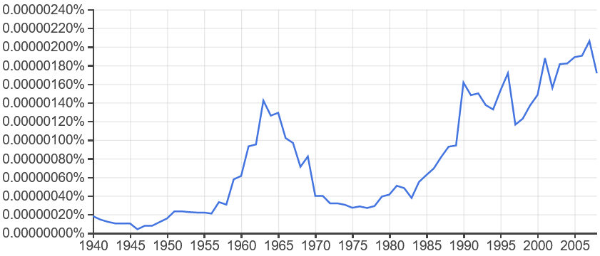

# Introduction

## L'effet cigogne dans le cas de l'apprentissage automatique par renforcement

### Réflexion

Tout vient d'une réflexion sur la différence entre corrélation et causalité. C'est un problème qui survient systématiquement lorsqu'on fait des statistiques descriptives à partir de données dont on dispose. 

L'apprentissage automatique peut lui aussi subir ce biais, ne serait-ce que parce que le biais vient des données en entrées (malgré une validation croisée).

Comment peut-on répondre à ce biais ?

Avec une randomisation : couper aléatoirement un échantillon en deux, agir sur seulement l'une des moitiés, comparer les résultats.

Comment peut-on répondre à ce biais automatiquement ?

On peut imaginer un algorithme qui va apprendre non pas à partir de données en entrée, mais face à une situation, en lui permettant d'agir dessus suivant un protocole expérimental rigoureux et robuste face à la confusion corrélation/causalité via un apprentissage par renforcement.

### Problématique

- Peut-on utiliser l'apprentissage par renforcement pour différencier ces corrélations de causalités ?

- Dans quelle mesure ce biais influence-t-il le résultat de prédictions basées sur l'apprentissage automatique ?

### Question sur les noms

Le français "apprentissage automatique" est-il vraiment synonyme de "machine learning" en anglais ?

Cela n'est pas certain quand on compare les fréquences de ces expressions au cours du temps.

Soit l'expression "apprentissage automatique" était porteuse d'un tout autre sens dans les années 1960, soit il s'agit de deux notions différentes, l'apprentissage automatique englobant le machine learning.

# I- Revue de littérature

## A- Une question triviale ?

### a) Dans le cas d'une régression

Dans le cas d'une régression, la question peut sembler triviale.

Puisqu'une régression consiste à mesurer les corrélations entre toutes les variables afin d'en estimer une à partir des autres, il suffit que certaines variables soient corrélées avec la celle à estimer pour biaiser les résultats. Pour combattre ce biais, il faut qu'un être humain analyse le contexte pour déterminer s'il y a causalité entre les variables.

http://www.cems.uwe.ac.uk/~irjohnso/coursenotes/uqc832/tr-bias.pdf

Cependant, cette étude montre que même dans le cas d'une régression il existe des méthodes permettant de diminuer ce biais

### b) Dans le cas de l'apprentissage par renforcement

Si le cas de la régression semblait trivial, c'est peut-être parce que l'algorithme n'a pas l'occasion d'interagir avec son environnement pour tester ce qui est une corrélation et ce qui est une causalité.

On peut d'ailleurs considérer trois types de variables : 

- les données intrinsèques à l'environnement (une partie des observations)

- les entrées (les actions de l'agent sur l'environnement)

- Les sorties issues des actions sur l'environnement (la récompense et une partie des observations)

## B- Effet cigogne

Sachant que A est corrélé à B

Explications possibles :

- A cause B

- B cause A

- A cause B et B cause A

- C connu cause A et B

- C inconnu cause A et B

- Coincidence

Cas trivial : si on ne peut observer C, on ne peut différencier le cas n°4 du cas n°5

### a) Exemples imaginaires

Dans le cas où A, la quantité vendue, est corrélé à une variable B

- La quantité vendue cause le résultat net

- Le prix cause la quantité vendue

- Le nombre de ventes cause la fréquentation à venir, qui cause le nombre de ventes à venir

- Les jours d'affluence causent la quantité vendue d'un produit et celle d'un autre produit

- La complémentarité entre la farine et la levure cause une corrélation entre les quantités vendues de l'un et de l'autre

- Une variable n'ayant aucun lien de causalité avec quoi que ce soit (ex: l'horoscope des sagittaires) peut néanmoins se retrouver corrélé avec d'autres variables si on ne dispose pas d'un échantillon suffisament grand. Peut alors exister un biais de sur-apprentissage.

### b) Exemples dans l'apprentissage automatique

#### Coïncidence

Il s'agit d'une question purement statistique. Il suffit d'avoir assez de données.

Peut-on aussi le voir comme un cas de problème de sur-apprentissage ?

#### Données d'apprentissage non représentatives (dont Biais de sélection)

##### Tromper l'agent si sa récompense n'est pas assez précise?

Si 80% de sa récompense est basée sur 20% de ses actions, l'algorithme mettra plus de temps à estimer l'importance respective de chaque variable.

On peut maximiser ce biais :

- En fournissant une récompense et/ou des observations aggrégées à une granularité trop épaisse

- Nous arrivons alors à une coïncidence et un biais de surapprentissage

##### https://app.wandb.ai/stacey/aprl/reports/Adversarial-Policies-in-Multi-Agent-Settings--VmlldzoxMDEyNzE

Résumé du protocole de cette publication :

- On prend deux agents, A et B, et un jeu compétitif.

- A apprend à jouer à partir de données de véritables joueurs.

- Puis B apprend à jouer contre A

Il en résulte que la meilleure manière pour B de gagner consiste à ne pas jouer. En effet, A n'a appris à jouer que contre des personnes qui savent jouer. B faisant des choses inattendues, A perd tout seul.

Conclusion : l'apprentissage par renforcement gagne sur le long terme face à un programme exclusivement formé sur des données qui ne recouvrent pas assez de cas.

#### Biais de confirmation

Les algos y sont-ils sensibles ? Causalité au début qui décroit avec le temps, mais l'algo continue dans le sens initial ?

#### Tous biais confondus

Même s'ils se corrigent facilement et automatiquement dans les algos déjà existants, on peut toujours en mesurer et comparer leurs interties

# II- Expérimentation

Faire interagir un agent suivant plusieurs algorithmes d'apprentissage par renforcement pour apprendre face à un environnement biaisé.

Pour créer des situation biaisées, on préfèrera utiliser une librairie permettant de créer un environnement.

J'ai choisi (/ commencé à utiliser) Tensorflow, car la documentation semble claire et bien fournie, et que la librairie implémente plusieurs algorithmes.

Diagramme de classes :

## A- L'agent et les algorithmes

Algorithmes présents dans TF :

- [DQN][1]

- [REINFORCE][2]

- [DDPG][3]

- [TD3][4]

- [PPO][5]

- [SAC][6]

TODO: réussir à les faire marcher, puis écrire une boucle for qui enregistre les résultats de chaque algos pour une configuration de l'environnement donnée

## B- L'environnement

On peut imaginer des prix mis à jour en temps réel par l'agent, l'objectif de l'agent étant de trouver le prix maximisant le résultat net.
L'environnement répondrait, pour chaque offre, une demande (un nombre d'achats).

Cas réels qui correspondraient : prix dans un centre commercial connecté, sur un site d'e-commerce, sur un marché à terme en temps réel (financier, de l'électricité, du blé), etc.

### a) L'implémentation

Dans TF, on peut créer deux types d'environnement : py_environment.PyEnvironment ou tf_environment.TFEnvironment. Les deux prennent en compte des paramètres similaires. Dans notre exemples :

- Le temps est linéaire et discret

- Action: pour chaque lieu et/ou produit, un prix de vente

- Observation: pour chaque lieu et/ou produit, une demande

- Récompense: la somme, pour chaque lieu et/ou produit, du prix de vente auquel on soustrait le prix d'achat.

### b) Paramètres à ajouter

Afin d'obtenir des résultats plus intéressants, on peut multiplier les paramètres possibles :

- élasticité demande selon offre

- prix plafond et prix plancher

- un seul lieu d'achat/vente ou bien plusieurs avec des prix différents

- les caractéristiques des lieux d'échange (nombre de clients, intérêt pour le produit, prix plafond et plancher)

- un seul ou plusieurs produits

- produits qui répondent ou non au même besoin

- coûts des produits identiques ou non

- coûts des produits qui changent au fil du temps ou non

- quelle part d'aléatoire

## C- Les biais à implémenter

### Données non représentatives

Un paramètre inconnu (la taille des magasins) est créé, et influence les résultats. Ensuite, on modifie ce paramètre, ou on ajoute des situations en moyenne différente (plus grands ou plus petits), et on observe combien de temps l'algo se laissera berner (aka on mesure son inertie)

A une étape de l'algorithme, arbitrairement jouter ou supprimer des magasins ou produits avec des caractéristiques non représentatives de la population de départ.

Exemples : 

- l'expérience était sur les carrefour city, elle inclut par la suite également les carrefour market, d'une taille en moyenne différente. Toutes les quantités varient.

- la chaîne s'étend sur un territoire avec des habitudes de consommation différentes

### Inciter au biais de confirmation

En utilisant le biais du razoir d'Ockham (privilégier les modèles les plus simples peut conduire à oublier une variable) mentionné dans cette publication :

- https://arxiv.org/pdf/cmp-lg/9612001.pdf

- Etape 1- créer un biais du razoir : 

  - Créer deux variables corrélées, l'une expliquant, pas l'autre, pour que l'agent en prenne une au pif
  
- Mais tadaaaaa ! En fait c'était l'autre la bonne !!!

ça peut marcher ? vérifier les implémentations des algos

Ou bien, on verra bien une fois qu'on a testé

# III-  Analyse des résultats

Questions auxquelles on souhaitait répondre :

- Quelle est l'efficacité l'agent qui ne peut apprendre qu'avec des données ayant déjà été observées et biaisées (apprentissage supervisé) 

- Versus l'efficacité si on pré-entraine l'agent avec des données ayant déjà été observées puis qu'on le laisse se renforcer sans randomisation (apprentissage supervisé et par renforcement) 

- Versus l'efficacité si on pré-entraine l'agent avec des données ayant déjà été observées puis qu'on le laisse se renforcer avec randomisation (apprentissage supervisé et par renforcement)

Questions supplémentaires, dans le cas où je développe un algorithme qui effectue explicitement une randomisation pour tester si les corrélations observées sont des causalités :

- Versus l'efficacité de l'apprentissage par renforcement seul avec randomisation

- Versus l'efficacité de l'apprentissage par renforcement seul sans randomisation

## A- Si la réponse est explicite

## B- Si les résultats nécessitent de comparer les chiffres

Pour quels paramètres et quels biais, quels algorithmes obtiennent quel résultat sur un grand nombre d'opérations ?

## C- Biais de la démarche

### a) Données fictives, donc conditionnées à mon imagination

### b) Cas impossibles à tester ou dont les résultats sont difficiles à analyser

## D- Ouverture

### Comparaisons impossibles

Seulement des tests d'un agent face à un environnement

#### On ne peut pas extrapoler les comparaisons entre algorithmes en concurrence.

#### Ni comparer avec des résultats obtenus par régression

# Conclusion

# Sources

[1]: https://storage.googleapis.com/deepmind-media/dqn/DQNNaturePaper.pdf

[2]: http://www-anw.cs.umass.edu/%7Ebarto/courses/cs687/williams92simple.pdf

[3]: https://arxiv.org/pdf/1509.02971.pdf

[4]: https://arxiv.org/pdf/1802.09477.pdf

[5]: https://arxiv.org/abs/1707.06347

[6]: https://arxiv.org/abs/1801.01290

- https://scholar.google.com/scholar?hl=fr&as_sdt=0%2C5&q=reinforcement+learning+causality
  - En 2009 : https://www.ncbi.nlm.nih.gov/pmc/articles/PMC2713351/
  - 2019 : https://arxiv.org/abs/1901.08162
  - 2018 : https://ieeexplore.ieee.org/abstract/document/8115277
  - ? : https://books.google.fr/books?hl=fr&lr=&id=2qt0DgAAQBAJ&oi=fnd&pg=PA295&dq=reinforcement+learning+causality&ots=aypw5lcR00&sig=Buj0QQOXRdF6_rFoCpeov9HdVYM&redir_esc=y#v=onepage&q=reinforcement%20learning%20causality&f=false

# VRAC

## Résumés de publications

> http://www.cems.uwe.ac.uk/~irjohnso/coursenotes/uqc832/tr-bias.pdf

- **Solution** : réduction de la variance

- **Problème** : coûteux en ressources (pour l'époque ?)

- **Comment l'utiliser** : La question a déjà été traitée, mais il y a 25 ans, et seulement pour l'apprentissage supervisé, et ça coûtait trop de ressources.

- **Peut-être toujours d'actualité pour le renforcement ?** De plus, si on combine une réduction de variance avec un algo plus récent et moins coûteux, ça pourrait être pas mal.

> https://arxiv.org/pdf/cmp-lg/9612001.pdf

> https://people.csail.mit.edu/malte/pub/papers/2019-iclr-variance.pdf

> https://dl.acm.org/doi/10.5555/3305381.3305400

à propos de la baisse de la variance grâce à l'algo DQN

> https://link.springer.com/article/10.1007/s11219-012-9180-0

sur le biais de confirmation

