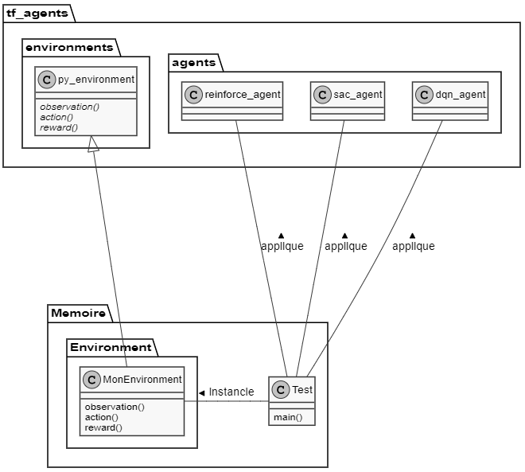

# __Etude de biais dans l'apprentissage automatique__

## Plus précisément, l'effet cigogne dans le cas de l'apprentissage automatique par renforcement

# Introduction

## Réflexion

Tout vient d'une réflexion sur la différence entre corrélation et causalité. C'est un problème qui survient systématiquement lorsqu'on fait des statistiques descriptives à partir de données dont on dispose. 

L'apprentissage automatique peut lui aussi subir ce biais, ne serait-ce que parce que le biais vient des données en entrées, et ce, malgré une validation croisée.

Quelle réponse peut-on apporter à ce biais ?

Avec une randomisation : couper aléatoirement un échantillon en deux, agir sur seulement l'une des moitiés, comparer les résultats.

Comment peut-on répondre à ce biais automatiquement ?

On peut imaginer un algorithme qui va apprendre non pas à partir de données en entrée, mais face à une situation, en lui permettant d'agir dessus.

On peut donc imaginer ajouter d'une randomisation au sein d'un algorithme d'apprentissage par renforcement pour améliorer ses résultats, ou du moins pour voir si ses résultats évoluent.

## Définitions

Effet cigogne : confusion entre corrélation et causalité

Corrélation : lien mesurable statistiquement entre deux variables

Causalité : Lien de cause à effet entre deux phénomènes

__Définitions issues principalement du Journal officiel n° 0285 du 09/12/2018 https://www.legifrance.gouv.fr/jo_pdf.do?id=JORFTEXT000037783813 :__

Apprentissage automatique : "Processus par lequel un  algorithme évalue et  améliore ses performances sans l’intervention d’un programmeur, en répétant son exécution sur des jeux de données jusqu’à obtenir, de manière régulière, des résultats pertinents".

Le journal officiel le traduit par "machine learning" en anglais. Cela n'est pas certain quand on compare les fréquences de ces expressions au cours du temps avec Ngrams viewer.

Soit l'expression "apprentissage automatique" était porteuse d'un tout autre sens dans les années 1960, soit il s'agit de deux notions différentes avec le même nom.

Apprentissage automatique dans le corpus francophone :

Machine learning dans le corpus anglophone :

Apprentissage par renforcement : "Apprentissage automatique dans lequel un programme extérieur évalue positivement ou négative-ment les  résultats successifs de  l’algorithme, l’accumulation des résultats permettant à  l’algorithme d’améliorer ses performances jusqu’à ce qu’il atteigne un objectif préalablement fixé."

Agent : algorithme d'apprentissage par renforcement.

## Problématique

Par "biais", on considèrera la définition suivante : "une démarche ou un procédé qui engendre des erreurs".

La définition formelle en statistique de biais, "différence entre la valeur de l'espérance d'un estimateur et la valeur qu'il est censé estimer" correspondrait à un problème de régression. 

Pour un algorithme d'apprentissage par renforcement, l'objectif n'est pas tant d'estimer au plus proche une variable que d'en maximiser une. Cela dit, comme les algorithmes d'apprentissage automatique utilisent des indicateurs statistiques sensibles aux biais, ils sont aussi soumis au dilemme biais-variance (le biais diminue à mesure que la complexité du modèle s'approche de la complexité de l'environnement).

- Peut-on utiliser l'apprentissage par renforcement pour différencier des corrélations de causalités ?

- Dans quelle mesure ce biais influence-t-il le résultat de prédictions basées sur l'apprentissage automatique ?

- En cas de correction d'un modèle biaisé, avec quelle inertie les algorithmes apprennent de leurs erreurs ?

__Autres comparaisons possibles__

- Quelle est l'efficacité l'agent qui ne peut apprendre qu'avec des données ayant déjà été observées et biaisées (apprentissage supervisé) 

- Versus l'efficacité si on pré-entraine l'agent avec des données ayant déjà été observées puis qu'on le laisse se renforcer sans randomisation (apprentissage supervisé et par renforcement) 

- Versus l'efficacité si on pré-entraine l'agent avec des données ayant déjà été observées puis qu'on le laisse se renforcer avec randomisation (apprentissage supervisé et par renforcement)

Questions supplémentaires, dans le cas où je développe un algorithme qui effectue explicitement une randomisation pour tester si les corrélations observées sont des causalités :

- Versus l'efficacité de l'apprentissage par renforcement seul avec randomisation

- Versus l'efficacité de l'apprentissage par renforcement seul sans randomisation

# I- Revue de littérature

## A- Une question triviale ?

### a) Dans le cas d'une régression

__Pourquoi parler de la régression ?__

Dans le cas d'une régression, la question peut sembler triviale.

Si confusion entre corrélation et causalité il y a, ça n'est pas au niveau des algorithmes d'apprentissage automatique, qui n'étudient que les corrélations. C'est lors de l'utilisation de ces algorithmes qu'il peut y avoir confusion.

Puisqu'une régression consiste à mesurer les corrélations entre toutes les variables afin d'en estimer une à partir des autres, il suffit que certaines variables soient corrélées avec la celle à estimer pour biaiser les résultats. Pour combattre ce biais, il faut qu'un être humain analyse le contexte pour déterminer s'il y a causalité entre les variables.

> http://www.cems.uwe.ac.uk/~irjohnso/coursenotes/uqc832/tr-bias.pdf

Cependant, cette étude montre que même dans le cas d'une régression il existe des méthodes permettant de diminuer ce biais

### b) Dans le cas de l'apprentissage par renforcement

Si le cas de la régression semblait trivial, c'est peut-être parce que l'algorithme n'a pas l'occasion d'interagir avec son environnement pour tester ce qui est une corrélation et ce qui est une causalité.

On peut d’ailleurs différencier trois types de variables qui construisent la réalité avec laquelle interagit un agent :

- les données intrinsèques à l'environnement (une partie des observations)

- les entrées (les actions de l'agent sur l'environnement)

- Les sorties issues des actions sur l'environnement (la récompense et une partie des observations)

Au sein des librairies que nous utiliseront, ces variables sont découpées de la sorte :

- Les observations (qu'elles dépendent des actions de l'agent ou non)

- Les actions (les décisions prises par l'agent)

- La récompense (ce que l'agent doit maximiser)

Ainsi, contrairement au cas d'une régression, il est déterminé dès le départ sur quoi l'agent peut agir. L'agent ne peut pas vérifier l'existence de causalité entre deux variables qui ne dépendent pas de lui. 

On pourrait se dire que l'algorithme fera explorera l'environnement à sa disposition pour maximiser sa récompense indépendamment de toute notion de toute notion de causalité. Cependant, il reste possible d'expérimenter si et dans quelle mesure l'algorithme tombe dans des biais.

## B- Les différents cas de corrélation

### a) Théoriques

Sachant que A est corrélé à B, il y a plusieurs explications possibles :

- A cause B

- B cause A

- A cause B et B cause A

- C connu cause A et B

- C inconnu cause A et B

- Coincidence

Si on ne peut observer C, peut-on différencier le cas 5 du cas 6 ? Peut-on estimer que nos données semblent répondre à une variable supplémentaire inconnue à partir d'une certaine quantité de données permettant d'écarter l'idée d'une coincidence ? Si oui, peut-on mesurer cette variable ? (sachant qu'on risque de la confondre avec le vrai bruit statistique)

### b) Illustration de ces cas

Dans le cas où A, la quantité vendue, est corrélé à une variable B

- La quantité vendue cause le résultat net

- Le prix de vente cause la quantité vendue

- Le nombre de ventes cause la fréquentation à venir, qui cause le nombre de ventes à venir

- Les jours d'affluence causent la quantité vendue d'un produit et celle d'un autre produit

- La complémentarité entre la farine et la levure cause une corrélation entre les quantités vendues de l'un et de l'autre

- Une variable n'ayant aucun lien de causalité avec quoi que ce soit (ex: l'horoscope des sagittaires) peut néanmoins se retrouver corrélé avec d'autres variables si on ne dispose pas d'un échantillon suffisament grand. Peut alors exister un biais de sur-apprentissage.

## C- Exemples de biais dans l'apprentissage automatique

### a) Biais induits au sein des algorithmes

> https://arxiv.org/pdf/1907.02908.pdf

Quand un agent est développé pour répondre à un besoin spécifique, on peut être tenté de le paramétrer via des connaissances préexistantes afin d'améliorer ses résultats. Cela peut causer des erreurs supplémentaires, en plus de rendre l'algorithme moins généralisable.

#### Exemple de ce problème dans notre expérimentation

Si notre agent doit acheter des marchandises puis les vendre, avec comme récompense la marge sur coûts variables.

Pour lui éviter d'essayer des cas triviaux et a priori contreproductifs, on serait tenté de le paramétrer de telle sorte qu'il ne fixe jamais de prix de vente inférieur au prix d'achat. Ce qui serait une bonne idée sans compter que :

- Un produit d'appel peut être vendu à perte et pourtant améliorer le revenu global

- Si l'agent doit gérer ses stocks, il peut arriver qu'il doive vendre à perte pour déstocker (ex: péremption)

- Vendre ou acheter à perte peut parfois être une obligation légale 

  - Exemple : EDF qui achète à un prix plancher l'électricité issue d'énergies renouvelables sur le marché à terme de l'électricité

### b) Coïncidence

Il s'agit d'une question purement statistique. Il suffit d'avoir assez de données.

Peut-on considérer les erreurs qui y sont dues comme un exemple de sur-apprentissage ?

### c) Données d'apprentissage non représentatives (dont Biais de sélection)

#### Peut-on tromper l'agent s'il ne peut déterminer l'importance de ses actions dans la récompense finale ?

Si 80% de sa récompense est basée sur 20% de ses actions, l'algorithme mettra plus de temps à estimer l'importance respective de chaque variable.

On peut maximiser ce biais :

- En fournissant une récompense et/ou des observations aggrégées à une granularité trop épaisse

- Nous arrivons alors à une coïncidence et un biais de surapprentissage

#### https://app.wandb.ai/stacey/aprl/reports/Adversarial-Policies-in-Multi-Agent-Settings--VmlldzoxMDEyNzE

Résumé du protocole de cette publication :

- On prend deux agents, A et B, et un jeu compétitif.

- A apprend à jouer à partir de données de véritables joueurs.

- Puis B apprend à jouer contre A

Il en résulte que la meilleure manière pour B de gagner consiste à ne pas jouer. En effet, A n'a appris à jouer que contre des personnes qui savent jouer. B faisant des choses inattendues, A perd tout seul.

Conclusion : l'apprentissage par renforcement gagne sur le long terme face à un programme exclusivement formé sur des données qui ne recouvrent pas assez de cas.

### d) Biais de confirmation

Les algos y sont-ils sensibles ? Causalité au début qui décroit avec le temps, mais l'algo continue dans le sens initial ?

### e) Tous biais confondus

Même s'ils se corrigent facilement et automatiquement dans les algos déjà existants, on peut toujours en mesurer et comparer leurs interties.

# II- Expérimentation

Faire interagir un agent suivant plusieurs algorithmes d'apprentissage par renforcement pour apprendre face à un environnement biaisé.

Pour créer des situation biaisées, on préfèrera utiliser une librairie permettant de créer un environnement.

J'ai choisi Tensorflow, car la documentation semble claire et bien fournie, et que la librairie implémente de nombreux algorithmes de différentes catégories.

Diagramme de classes simplifié :

Le code est quant à lui sur le repository suivant : https://github.com/OdelinT/Memoire

(tant qu'il n'est pas public, me demander pour y accéder)

## A- L'agent

### a) Les algorithmes existants

Algorithmes présents dans TF :

- [DQN][1]

- [REINFORCE][2]

- [DDPG][3]

- [TD3][4]

- [PPO][5]

- [SAC][6]

### b) Ajouter une étape de randomisation

### c) Configuration et enregistrement des résultats

TODO: réussir à les faire marcher, puis écrire une boucle for qui enregistre les résultats de chaque algo pour une configuration de l'environnement donnée

## B- L'environnement

On peut imaginer des prix mis à jour en temps réel par l'agent, l'objectif de l'agent étant de trouver le prix maximisant le résultat net.
L'environnement répondrait, pour chaque offre, une demande (un nombre d'achats).

Cas réels qui correspondraient : prix dans un centre commercial connecté, sur un site d'e-commerce, sur un marché à terme en temps réel (financier, de l'électricité, du blé), etc.

### a) L'implémentation

Dans TF, on peut créer deux types d'environnement : py_environment.PyEnvironment ou tf_environment.TFEnvironment. Les deux prennent en compte des paramètres similaires. Dans notre exemples :

- Le temps est linéaire et discret

- Action: pour chaque lieu et/ou produit, un prix de vente

- Observation: pour chaque lieu et/ou produit, une demande

- Récompense: la somme, pour chaque lieu et/ou produit, du prix de vente auquel on soustrait le prix d'achat.

### b) Explication

## C- Les biais à implémenter

### Données non représentatives

Un paramètre inconnu (la taille des magasins) est créé, et influence les résultats. Ensuite, on modifie ce paramètre, ou on ajoute des situations en moyenne différente (plus grands ou plus petits), et on observe combien de temps l'algo se laissera berner (aka on mesure son inertie).

A une étape de l'algorithme, arbitrairement jouter ou supprimer des magasins ou produits avec des caractéristiques non représentatives de la population de départ.

Exemples : 

- l'expérience était sur les carrefour city, elle inclut par la suite également les carrefour market, d'une taille en moyenne différente. Toutes les quantités varient.

- la chaîne s'étend sur un territoire avec des habitudes de consommation différentes

### Inciter au biais de confirmation

En utilisant le biais du razoir d'Ockham (privilégier les modèles les plus simples peut conduire à oublier une variable) mentionné dans cette publication :

- https://arxiv.org/pdf/cmp-lg/9612001.pdf

- créer un biais du razoir : 

  - Créer deux variables corrélées, l'une expliquant beaucoup les observations, l'autre moins, pour que l'agent se concentre sur la première
  
  - Inverser l'importance de ces variables au fil du temps

- Comparer les résultats avec des tests directement sur la seconde variable

# III-  Analyse des résultats

## A- Si la réponse est explicite

## B- Si les résultats nécessitent de comparer les chiffres

Pour quels paramètres et quels biais, quels algorithmes obtiennent quel résultat sur un grand nombre d'opérations ?

## C- Biais de la démarche

### a) Données fictives, donc conditionnées à mon imagination

### b) Cas impossibles à tester ou dont les résultats sont difficiles à analyser

### c) "Effet cigogne" : une notion floue

Derrière cette appellation claire en langage naturel, on peut déduire tout un ensemble de biais dans le cas de l'apprentissage automatique. Ce choix de sujet n'est peut-être pas le plus adapté.

## D- Ouverture

### a) Comparaisons impossibles

Seulement des tests d'un agent face à un environnement

#### On ne peut pas extrapoler les comparaisons entre algorithmes en concurrence.

#### Ni comparer avec des résultats obtenus par régression

### b) Ce qui n'est pas traité

#### 1- Le cas de la régression, du clustering et de la classification

#### 2- La loi de goodhart

"Lorsqu'une mesure devient un objectif, elle cesse d'être une bonne mesure".

Cela semble l'un des principaux biais lors de la mise en oeuvre d'un algorithme d'apprentissage automatique pour répondre à une problématique. Il faut en effet s'assurer qu'il n'y aie pas des manières de maximiser la mesure qui sert d'objectif au détriment de l'objectif réel (effet rebond et effet cobra).

Ce biais et sa réponse sont cependant moins des questions techniques et intrinsèques aux algorithmes que des questions d'appréciation qualitative de la pertinence des indicateurs et objectifs.

#### 3- Temps réel

Il ne s'agit ici que de comparer que les résultats des algos face aux biais, indépendamment de leur temps d'exécution ou de leur consommation de ressources. Les résultats ne sont donc pas applicables dans une situation en temps réel où le temps d'exécution entre en conflit avec un temps de réponse imposé.

#### 4- Biais connexes

Face à des données d'apprentissage trop "propres", le modèle obtenu peut devenir rigide.

Cependant, je ne parle que de corrélation vs causalité. Ce problème est hors périmètre puisque la causalité est réelle.

#### 5- Algorithmes

(10/08) les tests ne sont faits qu'avec l'algorithme SAC (Soft-Actor Critic) car il s'agit de celui qui a donné rapidement les meilleurs résultats. Tous les résultats ne sont pas généralisables à tous les autres agents, particulièrement ceux de catégories différentes.

# Conclusion

# Sources

[1]: https://storage.googleapis.com/deepmind-media/dqn/DQNNaturePaper.pdf

[2]: http://www-anw.cs.umass.edu/%7Ebarto/courses/cs687/williams92simple.pdf

[3]: https://arxiv.org/pdf/1509.02971.pdf

[4]: https://arxiv.org/pdf/1802.09477.pdf

[5]: https://arxiv.org/abs/1707.06347

[6]: https://arxiv.org/abs/1801.01290

- https://scholar.google.com/scholar?hl=fr&as_sdt=0%2C5&q=reinforcement+learning+causality
  - En 2009 : https://www.ncbi.nlm.nih.gov/pmc/articles/PMC2713351/
  - 2019 : https://arxiv.org/abs/1901.08162
  - 2018 : https://ieeexplore.ieee.org/abstract/document/8115277
  - ? : https://books.google.fr/books?hl=fr&lr=&id=2qt0DgAAQBAJ&oi=fnd&pg=PA295&dq=reinforcement+learning+causality&ots=aypw5lcR00&sig=Buj0QQOXRdF6_rFoCpeov9HdVYM&redir_esc=y#v=onepage&q=reinforcement%20learning%20causality&f=false

# VRAC

## Résumés de publications

> http://www.cems.uwe.ac.uk/~irjohnso/coursenotes/uqc832/tr-bias.pdf

- **Solution** : réduction de la variance

- **Problème** : coûteux en ressources (pour l'époque ?)

- **Comment l'utiliser** : La question a déjà été traitée, mais il y a 25 ans, et seulement pour les régressions, et ça coûtait trop de ressources.

- **Peut-être toujours d'actualité pour le renforcement ?** De plus, si on combine une réduction de variance avec un algo plus récent et moins coûteux, ça pourrait être pas mal.

"Randomization is paradoxical, because at first glance it seems to increase variance by deliberately introducing variation into the splits in the decision tree."

> https://arxiv.org/pdf/cmp-lg/9612001.pdf

> https://people.csail.mit.edu/malte/pub/papers/2019-iclr-variance.pdf

> https://dl.acm.org/doi/10.5555/3305381.3305400

à propos de la baisse de la variance grâce à l'algo DQN

> https://www.ncbi.nlm.nih.gov/pmc/articles/PMC5722032/

Comment différencier (pas exactement mais souvent) corrélation de causalité en stats "normales"

Randomisation mendelienne

https://people.csail.mit.edu/malte/pub/papers/2019-iclr-variance.pdf

https://dl.acm.org/doi/10.5555/3305381.3305400

> https://academic.oup.com/ije/article/48/3/691/5132989

La randomisation mendelienne est sensible au biais de sélection

> https://arxiv.org/abs/1908.02983

No entiendo todo, mais il y a peut-être quelque chose à en tirer pour induire un biais de confirmation

> https://arxiv.org/pdf/1703.02702.pdf

"Robust Adversarial Reinforcement Learning" -> des choses à en tirer ?

Différents algos de RL

> https://spinningup.openai.com/en/latest/spinningup/rl_intro2.html

## Autres sources

https://fr.wikipedia.org/wiki/Dilemme_biais-variance

https://fr.wikipedia.org/wiki/Biais_algorithmique#Biais_cognitifs

https://www.ibm.com/blogs/ibm-france/2019/09/26/apprentissage-automatique-et-biais/

http://www.prclaudeberaud.fr/?129-erreur-ecologique-erreur-atomiste-lepidemiologie-contextuelle

## Idées

"On qualifie cette erreur faite dans les hypothèses du modèle de « biais »." "Le biais sera d’autant plus faible que le modèle approchera la complexité du problème. Inversement, si le modèle est trop simple, le biais sera très élevé"

> https://dataanalyticspost.com/Lexique/biais/